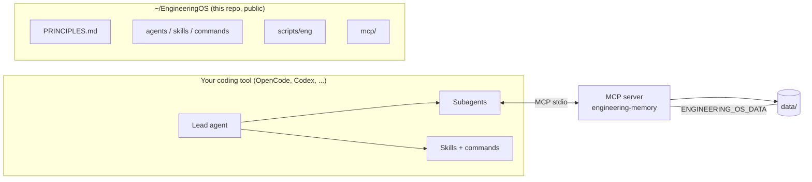
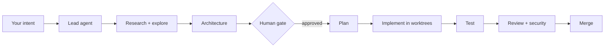
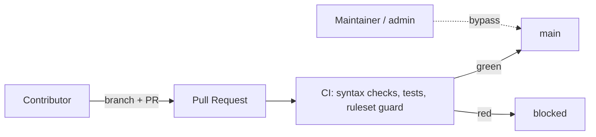

# EngineeringOS

A local-first **engineering operating system** for AI coding agents: a shared
context, memory, and state layer that sits under tools like OpenCode, Codex, or
Claude Code. The coding tool is the execution surface; EngineeringOS is the
system of record, so your agents stop forgetting everything between sessions.

It keeps durable, searchable memory across projects, architecture docs, ADRs,
technical research, and task state, and exposes it to agents through a small
local MCP server.

- **Public engine, private data.** This repository is the engine and contains no
  personal data. Everything you know lives in a separate data directory you
  version-control privately.
- **No dependencies.** The MCP server is stdlib-only Python. The CLI is one
  `bash` script. Nothing to `pip install`, no daemon, no cloud.
- **Agents with defined jobs.** A lead orchestrator delegates to specialized
  read-only and write agents instead of one super-agent doing everything.

---

## Contents

- [How it works](#how-it-works)
- [Quick start](#quick-start)
- [Everyday usage](#everyday-usage)
- [The agents](#the-agents)
- [The skills](#the-skills)
- [The commands](#the-commands)
- [The MCP server](#the-mcp-server)
- [The `eng` CLI](#the-eng-cli)
- [Split: public engine vs private data](#split-public-engine-vs-private-data)
- [Branch protection and contributing](#branch-protection-and-contributing)
- [Uninstall](#uninstall)
- [License](#license)

---

## How it works

Two directories, one environment variable between them:



The engine ships the rules, agent definitions, skills, commands, the MCP server,
and the CLI. Your data directory holds everything specific to you. `eng setup`
copies agents/skills/commands into `~/.config/opencode/` and wires the MCP server
into your OpenCode config with `$ENGINEERING_OS_DATA` pointing at your data.

Markdown is the source of truth. The SQLite database is a search index (FTS5
where available) and can be rebuilt. If the DB is lost, search falls back to
grepping the markdown.

---

## Quick start

**Requirements:** `git`, `python3` 3.9+ (with the `sqlite3` module), `bash`, and
[OpenCode](https://opencode.ai). `gh` is optional, only needed for the
`repo-protect` command.

```sh
# 1. Clone the engine
git clone https://github.com/Ay7ot/engineering-os.git ~/EngineeringOS

# 2. Bootstrap everything (idempotent, safe to re-run)
~/EngineeringOS/scripts/eng setup

# 3. Restart OpenCode so it loads the new agents, skills, commands, and MCP
```

`eng setup` does all of this for you:

- checks `git`, `python3`, `opencode` and verifies `sqlite3` is importable
- creates `~/EngineeringOS/data` with the standard layout
- seeds your `USER.md` from `USER.example.md` if you do not have one
- copies agents, skills, and commands into `~/.config/opencode/`
- registers the `engineering-memory` MCP server in `opencode.jsonc`
- sets `lead` as the default agent (only if you have not set your own)
- adds an `eng` shell alias to your `.zshrc` or `.bashrc`
- runs health checks and prints what it found

Then make it yours:

```sh
$EDITOR ~/EngineeringOS/data/USER.md    # who you are, how you work, approval gates
```

Optionally, put your data under version control in a **private** repo so you can
restore everything after a machine reset:

```sh
cd ~/EngineeringOS/data
git init && git add -A && git commit -m "chore: initial EngineeringOS data"
gh repo create engineering-os-data --private --source=. --push
```

### Restore after a machine reset

```sh
git clone https://github.com/Ay7ot/engineering-os.git ~/EngineeringOS
git clone <your-private-data-repo> ~/EngineeringOS/data
~/EngineeringOS/scripts/eng setup
```

---

## Everyday usage

Open OpenCode in a project and use the lead agent, either directly or through a
command. You provide intent and approve consequential decisions; the agents do
research, exploration, architecture, implementation, testing, review, and
bookkeeping.



A typical first run on an existing project:

```sh
cd /path/to/your/project
opencode
> /init-project
```

That maps the workspace, writes an `AGENTS.md`, and registers the project in
EngineeringOS memory.

---

## The agents

The lead agent classifies each task and picks the smallest safe workflow, so a
typo fix does not spin up nine agents.

| Agent | Mode | What it does | Can write code? |
|---|---|---|---|
| **lead** | primary | Orchestrates; classifies complexity; delegates; manages approval gates; final report | yes |
| **researcher** | subagent | Technical research from primary sources; persists reusable findings | no (writes research only) |
| **explorer** | subagent | Maps repositories and non-git workspaces; produces repo maps, not dumps | no |
| **architect** | subagent | Architecture proposals, alternatives, tradeoffs, ADRs, diagrams | markdown only |
| **planner** | subagent | Turns approved architecture into small, verifiable tasks | no |
| **builder** | subagent | Implements the approved plan; stops and reports on architectural problems | yes |
| **tester** | subagent | Writes tests, runs typecheck/lint/test/build, reports PASS/FAIL evidence | tests only |
| **reviewer** | subagent | Adversarial review; finds reasons NOT to merge | no |
| **security** | subagent | Security review of auth, data, secrets, injection, dependencies | no |

Read-only agents are locked down at the permission level: their `edit` and
`bash` access is denied except for the specific read-only commands they need.

**Workflows by complexity:**

| Complexity | Workflow |
|---|---|
| Simple | Do it directly, verify |
| Moderate | builder → tester |
| Important | explorer → builder → reviewer → tester |
| Complex | researcher + explorer → architect → **human gate** → planner → builders (parallel worktrees) → tester → reviewer → security → **human gate** if needed |

The human gate always stops for: major architecture decisions, destructive DB
migrations, production deploys, security-sensitive changes, irreversible data
operations, significant infrastructure changes, major product behavior, and
substantial cost. Everything else is inferred autonomously.

---

## The skills

Skills are playbooks loaded by agents when a task matches. They are plain
markdown, easy to read and copy.

| Skill | Use when |
|---|---|
| `api-design` | Designing HTTP/REST, GraphQL, RPC, or internal APIs |
| `architecture-analysis` | Analyzing or proposing a system, component, or significant change |
| `backend-architecture` | Planning or reviewing backend services |
| `code-review` | Reviewing a diff, branch, PR, or file adversarially |
| `database-design` | Designing schemas, migrations, or data access |
| `debugging` | Investigating a reported bug |
| `diagrams` | Authoring Mermaid diagrams for docs, plans, architecture |
| `documentation` | Writing README, AGENTS.md, ADRs, runbooks |
| `frontend-architecture` | Planning or reviewing frontend work |
| `git-workflow` | Any git operation: worktrees, branches, commits |
| `observability` | Adding logging, metrics, tracing, alerting |
| `payments` | Building or reviewing billing and payment flows |
| `project-planning` | Turning approved architecture into tasks |
| `repository-exploration` | Mapping an unfamiliar repository |
| `security-review` | Reviewing auth, payments, data, webhooks, secrets, infra |
| `technical-research` | Investigating unfamiliar technology or comparing options |
| `testing` | Writing tests or verifying acceptance criteria |

---

## The commands

Slash commands in OpenCode that run a full workflow through the lead agent.

| Command | What it does |
|---|---|
| `/init-project` | Map the workspace, write `AGENTS.md`, register the project |
| `/feature` | Full feature workflow: explore, research, architect, plan, build, test, review |
| `/research` | Technical research, persisted to EngineeringOS |
| `/debug` | Investigate, reproduce, test hypotheses, fix, regression-test |
| `/review` | Review current changes, a branch, a PR, or specific files |
| `/worktree` | Create, list, or close git worktrees for features and bug fixes |

---

## The MCP server

`mcp/engineering-memory/server.py` is a stdlib-only MCP server over stdio. It
exposes 13 tools:

| Tool | Purpose |
|---|---|
| `search_knowledge` | Full-text search across knowledge, decisions, research, project docs |
| `get_project_context` | Full project context: context, architecture, state, recent activity |
| `get_project_state` | Current state plus open tasks |
| `update_project_state` | Append a state entry; creates the project if missing |
| `search_decisions` / `get_decision` / `record_decision` | Architecture Decision Records |
| `search_research` / `get_research` / `record_research` | Persisted technical research |
| `get_active_tasks` / `record_task` / `update_task` | The task blackboard |

Test it directly:

```sh
printf '{"jsonrpc":"2.0","id":1,"method":"tools/list","params":{}}\n' \
  | ENGINEERING_OS_DATA=~/EngineeringOS/data python3 mcp/engineering-memory/server.py
```

---

## The `eng` CLI

One bash script, idempotent, no side effects on re-run.

```sh
eng setup                            # bootstrap deps, data, config, MCP, health
eng health                           # verify engine, data, MCP, agents, skills
eng sync-opencode                    # re-sync agents/skills/commands + MCP config
eng worktree new <name> [--type fix] # isolated worktree per feature/bug
eng worktree list                    # show active and closed worktrees
eng worktree close <name>            # remove it (refuses if dirty)
eng repo-protect --check             # show branch-protection drift vs GitHub
eng repo-protect                     # apply .github/ruleset.json
```

Worktrees use a sibling path (`../<repo>-<slug>-wt`), auto-detect the base
branch, register themselves in `projects/<name>/worktrees.md`, and refuse to
close over uncommitted changes unless you pass `--force`. One writer per
worktree, never two.

---

## Split: public engine vs private data

```
~/EngineeringOS/         ← this public engine repo (no personal data)
~/EngineeringOS/data/    ← your private data (gitignored here)
```

Your data layout:

```
data/
  USER.md            operator profile (from USER.example.md)
  knowledge/         durable cross-project knowledge
  decisions/         global ADRs
  research/          persisted technical research
  projects/<name>/   context.md, architecture.md, state.md, decisions/, worktrees.md
  tasks/  state/     blackboard scratch space
  memory/engineering_memory.db   SQLite + FTS5 index
```

Override the data location with `$ENGINEERING_OS_DATA`. That environment
variable is the only coupling point between the engine and your data.

**Rule (`PRINCIPLES.md` §7): never commit secrets or personal data.** Keep your
data repo private by default.

---

## Branch protection and contributing

`main` is protected: no direct pushes from contributors, no force-push, no
deletion, and CI must pass. The policy lives in
[`.github/ruleset.json`](.github/ruleset.json) so it is readable and reviewable
like any other change.



Contributor flow:

```sh
git checkout -b feat/short-description
# ... change ...
git commit -m "feat(scope): short description"
git push -u origin feat/short-description
gh pr create --fill
```

CI runs `bash -n scripts/eng`, `python3 -m py_compile`, `tests/test_eng.sh`,
`tests/test_mcp.sh`, and `tests/test_ruleset.py`. Run the same tests locally
before you push and CI should be green.

Maintainers apply protection changes with:

```sh
eng repo-protect --check   # read-only drift report
eng repo-protect           # apply
```

Read [CONTRIBUTING.md](CONTRIBUTING.md) before your first PR. This project
follows the [Contributor Covenant](CODE_OF_CONDUCT.md). Security issues go
through [SECURITY.md](SECURITY.md), never a public issue.

---

## Uninstall

```sh
# Remove the engine sync (agents, skills, commands, MCP config) then delete the repos.
rm -rf ~/.config/opencode/agents ~/.config/opencode/skills ~/.config/opencode/commands
# Edit ~/.config/opencode/opencode.jsonc and remove the "engineering-memory" mcp entry.
rm -rf ~/EngineeringOS
```

Your data lives at `~/EngineeringOS/data` (or `$ENGINEERING_OS_DATA`). Back it up
first if you want to keep it; deleting the engine does not delete your private
data repo.

---

## License

MIT, see [LICENSE](LICENSE).
