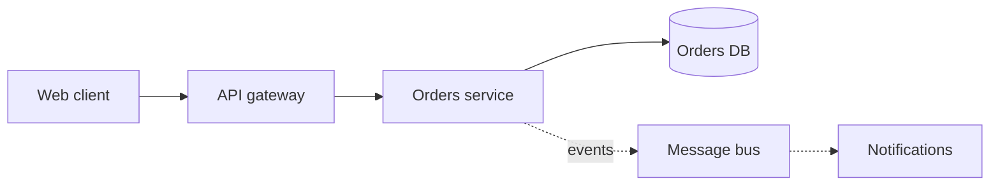
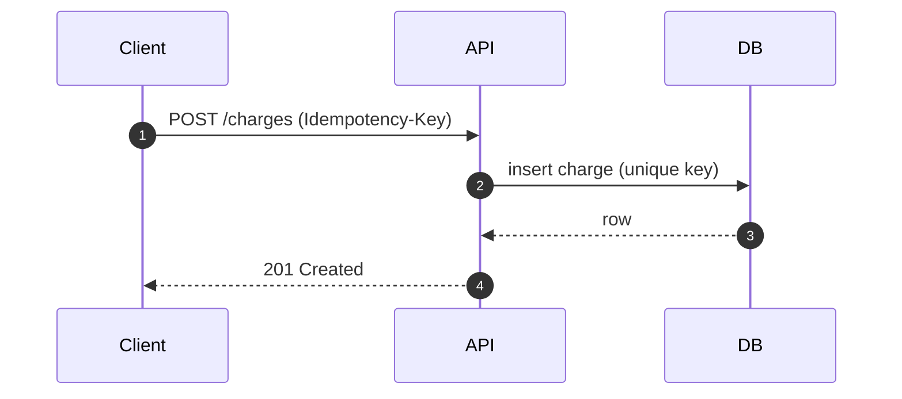
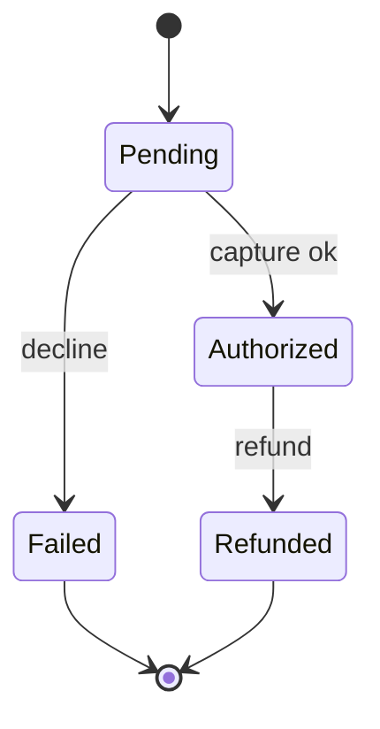
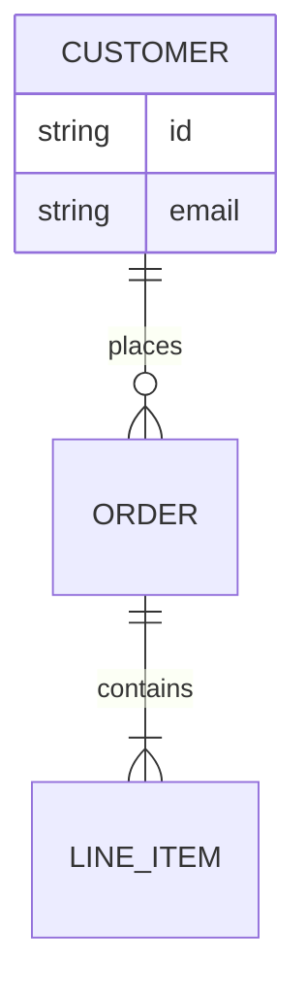
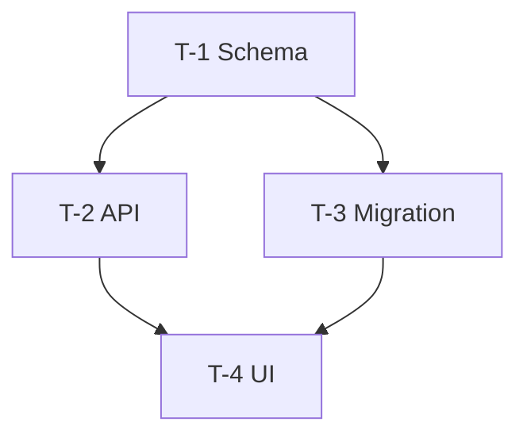
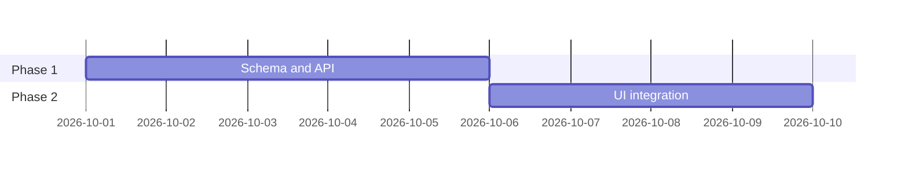

# Diagrams (Mermaid)

## When to use
- Explaining a system, change, data/control flow, or decision to the operator.
- Producing an architecture proposal (context/component + sequence/data-flow).
- Producing an implementation plan (dependencies, phases, critical path).
- Writing docs, ADRs, runbooks, or READMEs where prose is slow to parse.

A diagram is analysis, not decoration. If it would not change a reader's understanding, skip it.

## Golden rules
1. **Diagram keyword on line 1**, one idea per diagram. Never mix concerns.
2. **Prefer stable, portable types** — `flowchart`, `sequenceDiagram`, `stateDiagram-v2`, `erDiagram`, `classDiagram`, `gantt`. Avoid experimental/beta types for anything important (see table).
3. **Quote any label** containing spaces, punctuation, parentheses/brackets/braces, unicode, or `end`. Quote user text only, never keywords.
4. **Emit no colours and no theme overrides.** The same fenced block is re-themed by OpenCode's TUI/desktop, GitHub, GitLab, VS Code, and Mermaid Live. Hard-coded fills clash with host light/dark themes.
5. **Always add `accTitle` and `accDescr`** (accessibility, and it forces a one-line statement of intent).
6. **Keep it small**: flowcharts ≤ ~20 nodes / ~30 edges; sequences ≤ ~6–8 participants. Split larger systems into a context diagram plus detail diagrams.
7. **Ship it as a fenced ```mermaid block.** It renders natively in the OpenCode TUI and desktop, and stays diffable text in Git. Export to SVG/PNG only when a target genuinely cannot render Mermaid.
8. **Never invent nodes or edges** the analysis/plan does not support. A wrong diagram is worse than none.

## Choose the right diagram type
| Job | Type | Status |
|---|---|---|
| Flows, architecture, dependencies, decisions | `flowchart` (`graph`) | Stable — most reliable |
| Runtime interaction / API ordering | `sequenceDiagram` | Stable |
| Lifecycles / state machines | `stateDiagram-v2` | Stable |
| Data model | `erDiagram` | Stable |
| Types / domain model | `classDiagram` | Stable |
| Schedules / roadmaps | `gantt` | Stable |
| Branching / releases | `gitGraph` | Stable |
| Prioritisation | `quadrantChart` | Stable |
| Requirements traceability | `requirementDiagram` | Stable |
| Proportions | `pie` | Stable |
| Cloud/service topology | `architecture-beta` | Beta — host-verify |
| C4 context/container/component | `C4*` | Experimental — avoid for generated output |
| Hierarchy | `mindmap` | Experimental |
| Chronology | `timeline` | Experimental |

**Default choice for architecture: `flowchart`** with subgraphs. Use `sequenceDiagram` for ordering and `erDiagram`/`stateDiagram-v2` when the decision is about data or lifecycle. Do not reach for C4/mindmap/block-beta unless you have confirmed the host renders them.

## Syntax that breaks (fix these)
- **Unknown keyword aborts the diagram; unknown parameter fails silently.** Use documented keywords/params.
- **Lowercase `end`** as a bare node/participant id can break flowcharts/sequences on some Mermaid versions and hosts. Prefer `End` / `END`, or wrap: `(end)`, `[end]`, `{end}`.
- **`A---oB` / `A---xB`** create circle/cross edges. Add a space or capitalise: `A--- oB`.
- **Nested nodes** confuse the parser — quote the label.
- **Never put `{` or `}` inside a `%%` comment** — it forms `%%{...}%%` and confuses the renderer.
- **Subgraph `direction` is ignored** when a node links outside the subgraph.
- **Sequence:** `;` becomes a line break (escape `#59;`); `#` must be `#35;`; hex colours in `box` are unsupported (use `rgb()/rgba()/hsl()/hsla()`).
- **Class:** no comma generics (`List<List<K,V>>`); special chars in labels need backticks.
- **ER:** attribute type must start with a letter; attribute comments cannot contain a double quote.
- **State:** `classDef` cannot target `[*]` or composite internals.
- **Gantt:** the tag comes first (`Task :t1, 2026-10-01, 5d`); an invalid duration silently becomes zero.
- **Frontmatter config, not directives:** `%%{init}%%` is deprecated — use YAML frontmatter `config:` if you must, and only for the `base` theme.

## Quoting and escaping
Quote a label when it contains spaces the parser could split, or any of `( ) [ ] { } : ; #`, unicode, or the word `end`.

```
✅  A["Deploy (blue/green)"] --> B["End of day"]
❌  A[Deploy (blue/green)] --> B[End of day]
```
Escape literal characters: `#` → `#35;`, `;` → `#59;`. Use `<br/>` for line breaks. Commas inside a `style`/`classDef` value must be escaped `\,`.

## Layout, size, and readability
- **Direction:** `LR` for flows/pipelines, `TD` for hierarchies and decision trees. Keep one direction per diagram.
- Short, stable, meaningful node IDs; put the human text in the label: `api["API Gateway"]`.
- Group by layer or bounded context with `subgraph`; beware the external-edge `direction` caveat.
- Reduce edge crossings with direction, grouping, declaration order, and sparse invisible links (`~~~`).
- Sequence: set `autonumber`, `wrap: true`, and keep participants to the essential few.
- Split once a diagram passes ~20 nodes: one overview diagram plus focused detail diagrams beats one dense one.

## Accessibility and maintainability
- Add both, always:
  ```
  accTitle: Checkout request flow
  accDescr: Client posts a charge; API validates idempotency and persists it.
  ```
  `accDescr` is one line with a colon, or a `{ ... }` block without a colon.
- Use `%%` comments on their own line to record intent. One statement per line.
- Prefer edge IDs over positional `linkStyle`.
- Assume `securityLevel: strict` (HTML encoded, clicks disabled) — do not rely on click handlers or callbacks.
- Respect host limits: `maxTextSize` 50000, `maxEdges` 500. Assume each host pins its own Mermaid version — stick to long-stable syntax; v12-only features (ELK default, fire-marked types, collapsible subgraphs) may silently fail elsewhere.

## Templates

**Architecture — context/component**


**Sequence — critical path**


**State machine**


**Data model**


**Plan — dependencies and critical path**


**Plan — phases over time**


## Verify before you ship
- The diagram must render, not just parse. OpenCode renders Mermaid natively in both the TUI (`opencode.merman`) and the desktop/web UI (inline SVG) — read it back and check direction, labels, and that every edge is intended.
- Optional deterministic check when a CLI is available:
  `npx -y @mermaid-js/mermaid-cli -i diagram.mmd -o diagram.svg`
- Note: OpenCode treats SVG as **text**, not an image. Export only for a host that cannot render Mermaid; keep the Mermaid source as the artifact of record.

## Checklist
- [ ] Keyword on line 1; one idea per diagram
- [ ] Stable/portable diagram type chosen deliberately
- [ ] Labels quoted where needed; no lowercase `end`; no braces in `%%` comments
- [ ] No hard-coded colours or theme overrides
- [ ] `accTitle` + `accDescr` present
- [ ] Within size limits (≤ ~20 nodes, ≤ ~8 sequence participants)
- [ ] Direction consistent (LR flows / TD hierarchies)
- [ ] Every node and edge is supported by the analysis or plan
- [ ] Rendered and read back once before shipping
